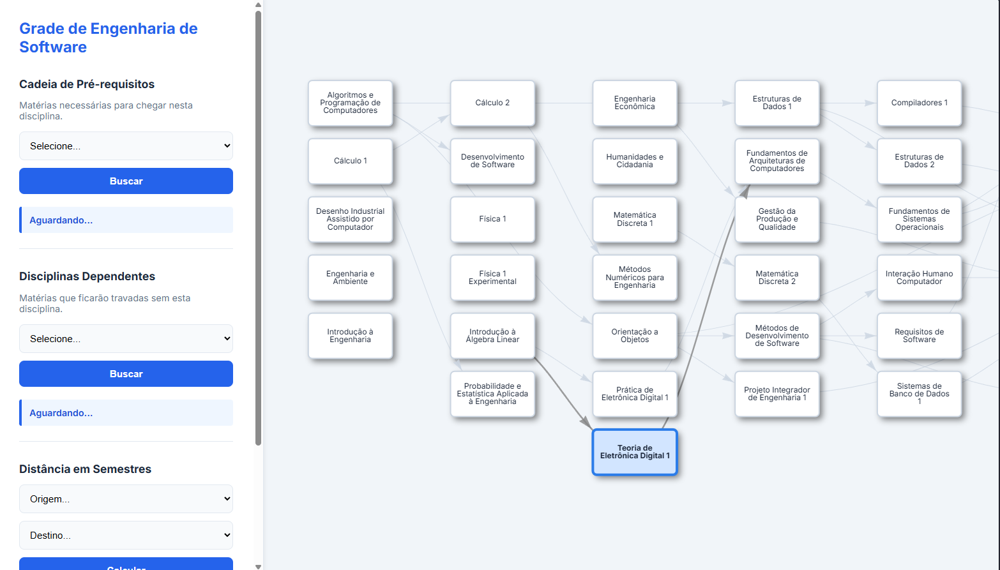
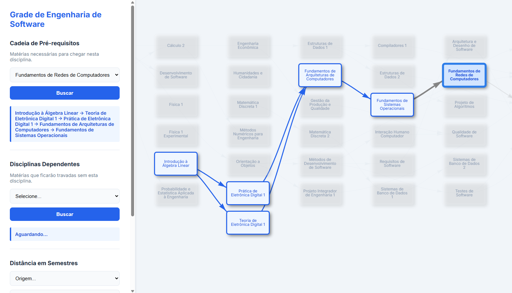
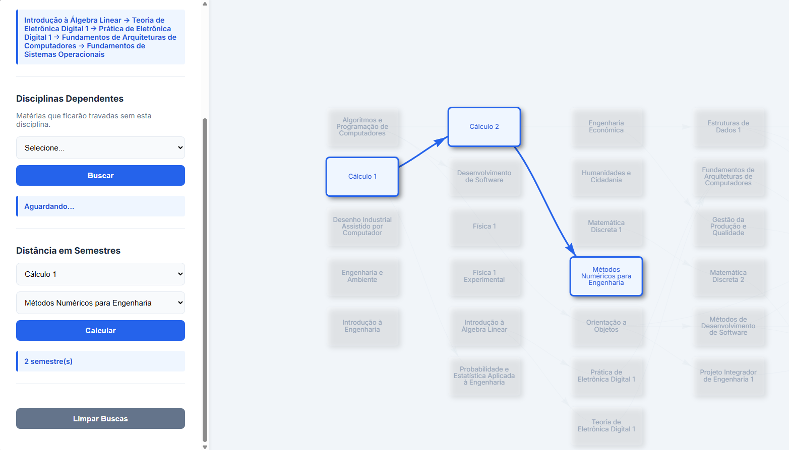

# Grade Curricular

Número da Lista: 19<br>
Conteúdo da Disciplina: Grafos<br>

## Alunos
|Matrícula | Aluno |
| -- | -- |
| 21/1061860 | Henrique Martins Alencar |

## Vídeo de Apresentação

* 

## Sobre 

Esse projeto é uma forma interativa de visualizar a grade curricular do curso de Engenharia de Software. A aplicação transforma a grade em um **Grafo**, permitindo buscar pré-requisitos e dependentes através da **Busca em Profundidade (DFS)** e calcular a distância em semestres entre duas matérias através da **Busca em Largura (BFS)**.

## Screenshots

### Página Inicial



### Busca de Pré-requisitos



### Quantidade de Semestres



## Instalação 
Linguagem: Python, HTML, CSS, JavaScript <br>
Framework: Flask <br>

### Pré-requisitos:

* Python 3.x

* Pip.

### Instalação e execução:

* Clone este repositório:

```bash
git clone https://github.com/eda2-2026/G19_Grafos_EDA2-2026.1
cd G19_Grafos_EDA2-2026.1
```

* Instale o Flask:

```bash
pip install flask
```

* Execute o servidor local:

```bash
python app.py
```

## Uso 

* Acesse o endereço: http://127.0.0.1:5000
* Busca de pré-requisitos: escolha a matéria que deseja ver seus pré-requisitos
* Busca de dependências: escolha a matéria que deseja ver quais são seus dependentes
* Distância em semestres: escolha duas matérias para saber qual a quantidade de semestres entre elas
